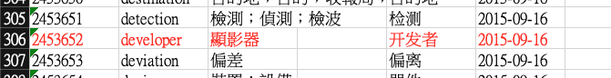

# S2T_Transformation (PO 檔案翻譯工具)

TODO...

- [ ] 自動化獲取 WIKI 數據
- [ ] 自動化獲取樂詞網數據
- [ ] 無法手動，目前會全自動檢查 QAQ。
- [ ] 樂詞網有些奇怪詞彙 例如『拉』跟『圖』，每次自動運行完進行修改 ods 詞彙文件後再次運行。

- 詞網加油好嗎？




## 功能描述

這個工具用於將 `.po` 檔案中的簡體中文文本翻譯成繁體中文。它讀取指定的輸入 `.po` 檔案，執行翻譯，並將結果輸出到新的檔案中。


1. 採用樂詞網的 ods 文件進行簡詞翻譯
2. 會針對 msgid 與 msgstr 進行翻譯
3. 翻譯結果可以由 log 進行查詢
4. 添加使用 WIKI 繁體中文對應數據...
5. 針對 taotixxxx 所使用的簡詞繁體字型詞彙進行處理(如果全部都是簡體字到沒問題)
   

- 本專案需要將樂詞網下載 ods 放置於 dataset 中，請於下面連結進行下載。

  https://terms.naer.edu.tw/download/10/

  

## 使用方法

### 建置使用環境(conda)

1. 安裝 Conda：
   如果你尚未安裝 Conda，請先下載並安裝 Miniconda 或 Anaconda。根據你的作業系統下載適用於 Python 3.8 的版本。
2. 開啟終端或命令提示字元：
   安裝完 Conda 後，打開終端（在 Windows 上是命令提示字元）。
3. 建立新環境：
   在終端中運行以下命令以建立新的 Python 3.8.19 環境：
   ```
    conda create --name chinese_corrector python=3.8.19
   ```
4. 啟動環境：
   完成後，你可以啟動新建立的環境。在終端中運行以下命令：
   ```
    conda activate chinese_corrector
   ```
5. 安裝 python 相依：
   ```
    pip install -r requirements.txt
   ```

## 在 Jupyter Notebook 中運行以下代碼塊來使用此工具

需要修改的內容如下(本項目可以直接運行)，有需求在進行修改：

```
input_document = "KiCad Taipei source zh Hant.po"
output_document = "KiCad_dev_testdata_translated.po"
auto_mode = True  # 手動模式 有bug還沒修好= =
debug_mode = False  # 開啟會打印更多資訊
logging_mode = True #如果開啟 會將有翻譯的行數與翻譯前後結果記錄於另外檔案
```

## 執行翻譯函數

```
process_po_file(input_document, output_document, translation_dict, auto_mode=False, debug_mode=True, logging_mode=True)
```


## 查看翻譯記錄

會於 log 底下產出文字檔，並且可以查看翻譯作為翻譯品質，並進行 ods 的數據修改後再次運行。


## 基於 基於 WIKI 文件進行運行 ，樂詞網需要評估翻譯品質


```
[112:msgstr] <不支持您的 OpenGL 版本。最低要求版本為 1.5。> -> <不支援您的 OpenGL 版本。最低要求版本為 1.5。>
[117:msgstr] <渲染時間 %.0f ms> -> <彩現時間 %.0f ms>
[200:msgstr] <渲染時間 %.3f s> -> <彩現時間 %.3f s>
[205:msgstr] <渲染: %.0f %%> -> <彩現: %.0f %%>
[209:msgstr] <渲染: 後期處理著色器> -> <彩現: 後期處理著色器>
[225:msgstr] <3D 查看器> -> <3D 檢視器>
[241:msgstr] <重置為默認設置> -> <重設為默認設置>
[290:msgstr] <使用光線追蹤渲染當前視圖> -> <使用光線追蹤彩現當前視圖>
[295:msgstr] <KiCad 3D 查看器> -> <KiCad 3D 檢視器>
[488:msgstr] <真實材質渲染> -> <真實材質彩現>
[496:msgstr] <純色渲染> -> <純色彩現>
[504:msgstr] <CAD 色彩渲染> -> <CAD 色彩彩現>
[556:msgstr] <在實時渲染器中顯示 3D 模型邊框> -> <在實時彩現器中顯示 3D 模型邊框>
[925:msgstr] <所有支持的檔案 (%s)> -> <所有支援的檔案 (%s)>
[934:msgstr] <配置路徑> -> <組態路徑>
[942:msgstr] <渲染選項> -> <彩現選項>
[970:msgstr] <真實渲染模式> -> <真實彩現模式>
[1014:msgstr] <渲染選項> -> <彩現選項>
[1050:msgstr] <必須關閉並重新打開 3D 查看器才能應用此設置> -> <必須關閉並重新打開 3D 檢視器才能應用此設置>
[1091:msgstr] <使用屏幕空間環境光遮蔽和全局光照反射 (慢)> -> <使用螢幕空間環境光遮蔽和全域光照反射 (慢)>
[1144:msgstr] <燈光配置> -> <燈光組態>
[1587:msgstr] <圖像分辨率:> -> <圖像解析度:>
[1754:msgstr] <KiCad 及其依賴不支持此操作系統。> -> <KiCad 及其依賴不支援此操作系統。>
[1758:msgstr] <不支持的操作系統> -> <不支援的操作系統>
[1772:msgstr] <消息> -> <訊息>
[1925:msgstr] <KiCad EDA 套件是一套用於設計電路原理圖和印刷電路板的開源應用程序。> -> <KiCad EDA 套件是一套用於設計電路原理圖和印刷電路板的開源應用程式。>
[1981:msgstr] <文件團隊> -> <檔案團隊>
[2040:msgstr] <文件> -> <檔案>
[2229:msgstr] <重置為默認值> -> <重設為默認值>
[2243:msgstr] <3D 搜索路徑別名不能為空。> -> <3D 搜尋路徑別名不能為空。>
[2247:msgstr] <3D 搜索路徑不能為空。> -> <3D 搜尋路徑不能為空。>
[2346:msgstr] <配置全局 %s 庫表> -> <組態全域 %s 庫表>
[2364:msgstr] <複製默認的全局 %s 庫表 (推薦)> -> <複製默認的全域 %s 庫表 (推薦)>
[2371:msgstr] <如果你不確定如何配置全局 %s 庫表, 請選擇此選項> -> <如果你不確定如何組態全域 %s 庫表, 請選擇此選項>
[2376:msgstr] <複製自定義全局 %s 庫表> -> <複製自定義全域 %s 庫表>
[2387:msgstr] <創建一個空的全局 %s 庫表> -> <創建一個空的全域 %s 庫表>
[2398:msgstr] <選擇全局 %s 庫表檔案:> -> <選擇全域 %s 庫表檔案:>
[2457:msgstr] <配置全局庫表> -> <組態全域庫表>
[2676:msgstr] <您想如何配置 KiCad?> -> <您想如何組態 KiCad?>
[2692:msgstr] <從先前版本匯入庫配置> -> <從先前版本匯入庫組態>
[2706:msgstr] <配置 KiCad 設置路徑> -> <組態 KiCad 設置路徑>
[2978:msgstr] <自動查找重複位號併為其分配新的可用位號。> -> <自動尋找重複位號併為其分配新的可用位號。>
[3028:msgstr] <插件選項> -> <外掛程式選項>
[3074:msgstr] <當前插件支持的選項> -> <當前外掛程式支援的選項>
[3086:msgstr] <打印> -> <列印>
[3092:msgstr] <打印預覽> -> <列印預覽>
[3150:msgstr] <沒有可打印的內容> -> <沒有可列印的內容>
[3155:msgstr] <上一個打印任務尚未完成。> -> <上一個列印任務尚未完成。>
[3159:msgstr] <打印時出現了問題。> -> <列印時出現了問題。>
[3163:msgstr] <初始化打印機資訊時出錯。> -> <初始化列印機資訊時出錯。>
[3204:msgstr] <打印圖紙> -> <列印圖紙>
[3208:msgstr] <打印圖框。> -> <列印圖框。>
[3229:msgstr] <消息文本> -> <訊息文本>
[3398:msgstr] <提交消息:> -> <提交訊息:>
[3410:msgstr] <提交消息不能為空> -> <提交訊息不能為空>
[3468:msgstr] <地址> -> <位址>
[3576:msgstr] <在搜索器中顯示主題> -> <在搜尋器中顯示主題>
[3752:msgstr] <交替著色表格的行> -> <交替著色電子試算表的行>
[3756:msgstr] <啟用後, 每隔一行表格都會使用不同的顏色> -> <啟用後, 每隔一行電子試算表都會使用不同的顏色>
[4045:msgstr] <重置唯一標識> -> <重設唯一標識>
[4202:msgstr] <縮放時將光標移至屏幕中心。> -> <縮放時將光標移至螢幕中心。>
[4240:msgstr] <將對象移出屏幕邊緣時的平移速度> -> <將對象移出螢幕邊緣時的平移速度>
[4360:msgstr] <反向> -> <逆向>
[4374:msgstr] <重置鼠標滾輪動作為默認值> -> <重設鼠標滾輪動作為默認值>
[4379:msgstr] <重置觸控板滾動手勢為默認值> -> <重設觸控板滾動手勢為默認值>
[4420:msgstr] <自動將已安裝的庫添加到全局庫表> -> <自動將已安裝的庫添加到全域庫表>
[4437:msgstr] <當前安裝的 KiCad 未啟用 API 支持。> -> <當前安裝的 KiCad 未啟用 API 支援。>
[4441:msgstr] <未啟用 KiCad API; 外部 Python 插件不可用> -> <未啟用 KiCad API; 外部 Python 外掛程式不可用>
[4447:msgstr] <未選擇有效的 Python 解釋器; 外部 Python 插件不可用> -> <未選擇有效的 Python 解釋器; 外部 Python 外掛程式不可用>
[4502:msgstr] <未選擇 Python 解釋器; 外部 Python 插件不可用> -> <未選擇 Python 解釋器; 外部 Python 外掛程式不可用>
[4749:msgstr] <來自引腳衝突映射> -> <來自引腳衝突對映>
[4782:msgstr] <無法使用 OpenGL, 回退到軟體渲染> -> <無法使用 OpenGL, 回退到軟體彩現>
[4971:msgstr] <無結尾的分隔字符串> -> <無結尾的分隔字元串>
[4975:msgstr] <字符串分割符號必須為 ' , \" , $ 之一的單字符> -> <字元串分割符號必須為 ' , \" , $ 之一的單字元>
[5124:msgstr] <插件選項> -> <外掛程式選項>
[5128:msgstr] <實時渲染器> -> <實時彩現器>
[5132:msgstr] <光線追蹤渲染器> -> <光線追蹤彩現器>
[5139:msgstr] <Gerber 查看器> -> <Gerber 檢視器>
[5158:msgstr] <插件> -> <外掛程式>
[5184:msgstr] <自動保存的檔案無法重命名為電路板檔案名。> -> <自動保存的檔案無法重新命名為電路板檔案名。>
[5192:msgstr] <文件檔案> -> <檔案檔案>
[5197:msgstr] <找不到文件檔案 '%s'。> -> <找不到檔案檔案 '%s'。>
[5202:msgstr] <文件檔案 '%s' 的 MIME 類型未知> -> <檔案檔案 '%s' 的 MIME 類型未知>
[5284:msgstr] <搜索> -> <搜尋>
[5301:msgstr] <屏幕> -> <螢幕>
[5334:msgstr] <文本框> -> <文字方塊>
[5339:msgstr] <表格> -> <電子試算表>
[5430:msgstr] <全局標籤> -> <全域標籤>
[5462:msgstr] <原理圖屏幕> -> <原理圖螢幕>
[5897:msgstr] <擴展內容管理器所下載的第三方插件、庫以及其他內容的存儲目錄。> -> <擴展內容管理器所下載的第三方外掛程式、庫以及其他內容的存儲目錄。>
[6046:msgstr] <無法創建全局庫表路徑 '%s'。> -> <無法創建全域庫表路徑 '%s'。>
[6137:msgstr] <無法獲取參考 '%s' 的 OID 引用> -> <無法獲取參考 '%s' 的 OID 參照>
[6177:msgstr] <無法推送到遠程> -> <無法推播到遠程>
[6231:msgstr] <遠程倉庫身份驗證失敗。> -> <遠程倉庫身分驗證失敗。>
[6263:msgstr] <向遠程倉庫推送更改失敗。> -> <向遠程倉庫推播更改失敗。>
[6267:msgstr] <未配置上游分支。> -> <未組態上游分支。>
[6301:msgstr] <剪切> -> <剪下>
[6305:msgstr] <剪切所選單元格內容到剪貼板> -> <剪下所選單元格內容到剪貼板>
[6450:msgstr] <不支持 %s。> -> <不支援 %s。>
[6455:msgstr] <目前不支持 DXF 構造線。> -> <目前不支援 DXF 構造線。>
[6459:msgstr] <目前不支持 DXF 弧形對齊文本。> -> <目前不支援 DXF 弧形對齊文本。>
[6470:msgstr] <目前不支持 DXF 測量標註。> -> <目前不支援 DXF 測量標註。>
[6474:msgstr] <目前不支持 DXF 網格。> -> <目前不支援 DXF 網格。>
[6478:msgstr] <目前不支持 DXF 曲線。> -> <目前不支援 DXF 曲線。>
[6482:msgstr] <目前不支持 DXF 3dfaces。> -> <目前不支援 DXF 3dfaces。>
[6486:msgstr] <目前不支持 DXF 實體。> -> <目前不支援 DXF 實體。>
[6490:msgstr] <目前不支持 DXF 中的圖像。> -> <目前不支援 DXF 中的圖像。>
[6678:msgstr] <全局標籤> -> <全域標籤>
[6854:msgstr] <工作點電流> -> <工作點電串流>
[6970:msgstr] <庫名稱中包含非法字符> -> <庫名稱中包含非法字元>
[6982:msgstr] <激活所選> -> <啟用所選>
[7019:msgstr] <無法識別的字符 '%c'> -> <無法識別的字元 '%c'>
[7071:msgstr] <查看詳情> -> <檢視詳情>
[7123:msgstr] <操作系統不支持此語言。> -> <操作系統不支援此語言。>
[7400:msgstr] <打印...> -> <列印...>
[7440:msgstr] <剪切所選項目到剪貼板> -> <剪下所選項目到剪貼板>
[7452:msgstr] <選擇屏幕上的所有項目> -> <選擇螢幕上的所有項目>
[7460:msgstr] <取消選擇屏幕上的所有項目> -> <取消選擇螢幕上的所有項目>
[7485:msgstr] <交互式刪除工具> -> <互動式刪除工具>
[7544:msgstr] <選擇表格> -> <選擇電子試算表>
[7556:msgstr] <在所選單元格上方插入新的表格行> -> <在所選單元格上方插入新的電子試算表行>
[7564:msgstr] <在所選單元格後插入新的表格行> -> <在所選單元格後插入新的電子試算表行>
[7572:msgstr] <在所選單元格前插入新的表格列> -> <在所選單元格前插入新的電子試算表列>
[7580:msgstr] <在所選單元格後插入新的表格列> -> <在所選單元格後插入新的電子試算表列>
[7617:msgstr] <編輯表格> -> <編輯電子試算表>
[7629:msgstr] <顯示搜索面板> -> <顯示搜尋面板>
[7633:msgstr] <顯示/隱藏搜索面板> -> <顯示/隱藏搜尋面板>
[7640:msgstr] <查找> -> <尋找>
[7644:msgstr] <查找文本> -> <尋找文本>
[7648:msgstr] <查找和替換> -> <尋找和替換>
[7652:msgstr] <查找和替換文本> -> <尋找和替換文本>
[7656:msgstr] <查找下一項> -> <尋找下一項>
[7660:msgstr] <查找下一個匹配項> -> <尋找下一個匹配項>
[7664:msgstr] <查找預覽> -> <尋找預覽>
[7668:msgstr] <查找上一個匹配項> -> <尋找上一個匹配項>
[7672:msgstr] <查找下一項標記> -> <尋找下一項標記>
[7676:msgstr] <替換並查找下一項> -> <替換並尋找下一項>
[7680:msgstr] <替換當前匹配項並查找下一個> -> <替換當前匹配項並尋找下一個>
[7718:msgstr] <刷新> -> <重新整理>
[7897:msgstr] <重置柵格原點> -> <重設柵格原點>
[7979:msgstr] <重置局部座標> -> <重設局部座標>
[7991:msgstr] <全屏十字光標> -> <全螢幕十字光標>
[7995:msgstr] <切換顯示全屏十字光標> -> <切換顯示全螢幕十字光標>
[8028:msgstr] <交互式測量點之間的距離> -> <互動式測量點之間的距離>
[8040:msgstr] <顯示 3D 查看器窗口> -> <顯示 3D 檢視器窗口>
[8103:msgstr] <配置路徑...> -> <組態路徑...>
[8107:msgstr] <編輯路徑配置環境變量> -> <編輯路徑組態環境變量>
[8115:msgstr] <編輯全局和專案符號庫列表> -> <編輯全域和專案符號庫列表>
[8123:msgstr] <編輯全局和專案封裝庫列表> -> <編輯全域和專案封裝庫列表>
[8143:msgstr] <在 Web 瀏覽器中打開產品文件> -> <在 Web 瀏覽器中打開產品檔案>
[8179:msgstr] <刷新插件> -> <重新整理外掛程式>
[8183:msgstr] <重新載入所有的 Python 插件並刷新插件菜單> -> <重新載入所有的 Python 外掛程式並重新整理外掛程式菜單>
[8259:msgstr] <信號名稱不能包含 CR 或 LF 字符> -> <信號名稱不能包含 CR 或 LF 字元>
[8296:msgstr] <位號不能包含字符 %s。> -> <位號不能包含字元 %s。>
[8301:msgstr] <值欄位不能包含字符 %s 。> -> <值欄位不能包含字元 %s 。>
[8306:msgstr] <封裝欄位不能包含字符 %s。> -> <封裝欄位不能包含字元 %s。>
[8311:msgstr] <數據手冊欄位不能包含字符 %s。> -> <數據手冊欄位不能包含字元 %s。>
[8316:msgstr] <圖紙名稱不能包含字符 %s。> -> <圖紙名稱不能包含字元 %s。>
[8321:msgstr] <圖紙檔案名不能包含字符 %s。> -> <圖紙檔案名不能包含字元 %s。>
[8326:msgstr] <該欄位不能包含字符 %s。> -> <該欄位不能包含字元 %s。>
[8330:msgstr] <位號不能包含文本變量引用> -> <位號不能包含文本變量參照>
[8338:msgstr] <尚未支持 Y 軸的鏡像> -> <尚未支援 Y 軸的鏡像>
[8372:msgstr] <渲染引擎> -> <彩現引擎>
[8390:msgstr] <軟體圖形加速 (適用於不支持 KiCad 硬體加速要求的計算機)> -> <軟體圖形加速 (適用於不支援 KiCad 硬體加速要求的計算機)>
[8462:msgstr] <全屏十字光標> -> <全螢幕十字光標>
[8486:msgstr] <最近搜索> -> <最近搜尋>
[8506:msgstr] <適應屏幕> -> <適應螢幕>
[8535:msgstr] <重置為默認值> -> <重設為默認值>
[8539:msgstr] <在查找器中顯示偏好設置> -> <在尋找器中顯示偏好設置>
[8548:msgstr] <重置 %s 為默認值> -> <重設 %s 為默認值>
[8621:msgstr] <重置為默認值> -> <重設為默認值>
[8841:msgstr] <便攜式文件格式檔案 (*.PDF)> -> <便攜式檔案格式檔案 (*.PDF)>
[8989:msgstr] <嘗試載入全局封裝庫表時出錯。> -> <嘗試載入全域封裝庫表時出錯。>
[9040:msgstr] <搜索文本> -> <搜尋文本>
[9077:msgstr] <配置錯誤> -> <組態錯誤>
[9250:msgstr] <查看選定的封裝> -> <檢視選定的封裝>
[9254:msgstr] <在封裝查看器中查看選定的封裝> -> <在封裝檢視器中檢視選定的封裝>
[9264:msgstr] <配置封裝分配檔案列表。這些檔案用於根據符號值自動分配封裝名稱。> -> <組態封裝分配檔案列表。這些檔案用於根據符號值自動分配封裝名稱。>
[9517:msgstr] <重置現有的批註> -> <重設現有的批註>
[9615:msgstr] <向列表中添加新的 BOM 生成器及其命令行> -> <向列表中添加新的 BOM 生成器及其命令列>
[9627:msgstr] <運行生成器的命令行:> -> <運行生成器的命令列:>
[9644:msgstr] <將 BOM 生成器腳本列表重置為默認設置> -> <將 BOM 生成器腳本列表重設為默認設置>
[9834:msgstr] <如果在新符號中為空, 則重置欄位> -> <如果在新符號中為空, 則重設欄位>
[9936:msgstr] <更新/重置欄位> -> <更新/重設欄位>
[9961:msgstr] <如果在庫符號中為空, 則重置欄位> -> <如果在庫符號中為空, 則重設欄位>
[9966:msgstr] <更新/重置欄位的文本內容> -> <更新/重設欄位的文本內容>
[9971:msgstr] <更新/重置欄位可見性設置> -> <更新/重設欄位可見性設置>
[9976:msgstr] <更新/重置欄位大小和樣式> -> <更新/重設欄位大小和樣式>
[9981:msgstr] <更新/重置欄位位置> -> <更新/重設欄位位置>
[9985:msgstr] <更新/重置符號特性> -> <更新/重設符號特性>
[9989:msgstr] <重置自定義電源符號> -> <重設自定義電源符號>
[10027:msgstr] <連接字符串(URL):> -> <連接字元串(URL):>
[10038:msgstr] <重新載入配置> -> <重新載入組態>
[10042:msgstr] <重新載入數據庫庫配置檔案> -> <重新載入數據庫庫組態檔案>
[10088:msgstr] <%u 個鏈接已映射, %u 個未找到> -> <%u 個鏈接已對映, %u 個未找到>
[10120:msgstr] <映射孤立符號> -> <對映孤立符號>
[10439:msgstr] <保存所有電流> -> <保存所有電串流>
[10443:msgstr] <要保存所有電流, 請使用以下指令: .probe alli> -> <要保存所有電串流, 請使用以下指令: .probe alli>
[10510:msgstr] <此插件已存在。> -> <此外掛程式已存在。>
[10553:msgstr] <圖紙間位號可見性由 原理圖設置 > 通用 > 格式 進行全局控制> -> <圖紙間位號可見性由 原理圖設置 > 通用 > 格式 進行全域控制>
[10908:msgstr] <無法創建全局庫表 '%s'。> -> <無法創建全域庫表 '%s'。>
[10913:msgstr] <將全局符號庫表 '%s' 複製到 '%s' 時出錯。> -> <將全域符號庫表 '%s' 複製到 '%s' 時出錯。>
[10971:msgstr] <全局標籤屬性> -> <全域標籤屬性>
[11335:msgstr] <從現有符號派生:> -> <從現有符號衍生:>
[11440:msgstr] <派生符號必須選擇一個父符號> -> <衍生符號必須選擇一個父符號>
[11497:msgstr] <派生自符號:> -> <衍生自符號:>
[12053:msgstr] <如果輸出格式支持, 則繪製背景顏色> -> <如果輸出格式支援, 則繪製背景顏色>
[12111:msgstr] <從 AUTHOR 和 SUBJECT 文本變量生成 PDF 文件屬性> -> <從 AUTHOR 和 SUBJECT 文本變量生成 PDF 檔案屬性>
[12280:msgstr] <搜索 (&S):> -> <搜尋 (&S):>
[12285:msgstr] <支持包含通配符的文本> -> <支援包含萬用字元的文本>
[12315:msgstr] <使用通配符> -> <使用萬用字元>
[12319:msgstr] <包括搜索引腳名稱和編號 (&N)> -> <包括搜尋引腳名稱和編號 (&N)>
[12323:msgstr] <搜索隱藏的欄位> -> <搜尋隱藏的欄位>
[12327:msgstr] <僅在當前圖紙中搜索 (&S)> -> <僅在當前圖紙中搜尋 (&S)>
[12331:msgstr] <僅在當前選區中搜索> -> <僅在當前選區中搜尋>
[12398:msgstr] <注意: 單個項目的顏色被全局偏好設置覆蓋。> -> <注意: 單個項目的顏色被全域偏好設置覆蓋。>
[12847:msgstr] <計算噪聲電流相關矩陣> -> <計算噪聲電串流相關矩陣>
[12867:msgstr] <(輸出電壓)/ (輸入電流)> -> <(輸出電壓)/ (輸入電串流)>
[12884:msgstr] <查找:> -> <尋找:>
[12908:msgstr] <用戶配置> -> <用戶組態>
[12963:msgstr] <描點顯示電流/相位> -> <描點顯示電串流/相位>
[13019:msgstr] <電流> -> <電串流>
[13189:msgstr] <器件:> -> <元件:>
[13193:msgstr] <器件類型:> -> <元件類型:>
[13333:msgstr] <重命名欄位> -> <重新命名欄位>
[13477:msgstr] <字符串分隔符:> -> <字元串分隔符:>
[13679:msgstr] <由於當前用戶對專案資料夾 '%s' 的權限不足, 因此無法重新映射。> -> <由於當前用戶對專案資料夾 '%s' 的權限不足, 因此無法重新對映。>
[13730:msgstr] <已映射符號 %s 到符號庫 '%s'。> -> <已對映符號 %s 到符號庫 '%s'。>
[13734:msgstr] <符號庫表映射完成!> -> <符號庫表對映完成!>
[13739:msgstr] <無法創建專案重新映射備份資料夾 '%s'。> -> <無法創建專案重新對映備份資料夾 '%s'。>
[13788:msgstr] <重新映射符號> -> <重新對映符號>
[13819:msgstr] <表格屬性> -> <電子試算表屬性>
[13865:msgstr] <編輯表格...> -> <編輯電子試算表...>
[13870:msgstr] <編輯表格屬性及單元格內容> -> <編輯電子試算表屬性及單元格內容>
[13880:msgstr] <文本框屬性> -> <文字方塊屬性>
[13997:msgstr] <如果在父符號中該欄位為空, 則重置欄位> -> <如果在父符號中該欄位為空, 則重設欄位>
[14092:msgstr] <顯示工作點電流> -> <顯示工作點電串流>
[14356:msgstr] <網路/嵌套總線名稱> -> <網路/巢狀總線名稱>
[14414:msgstr] <全局標籤邊距比率:> -> <全域標籤邊距比率:>
[14419:msgstr] <全局標籤周圍的空間佔文本大小的百分比> -> <全域標籤周圍的空間佔文本大小的百分比>
[14565:msgstr] <有效數字 (電流):> -> <有效數字 (電串流):>
[14569:msgstr] <範圍 (電流):> -> <範圍 (電串流):>
[14731:msgstr] <表格條目的行名稱和庫路徑單元格為空。> -> <電子試算表條目的行名稱和庫路徑單元格為空。>
[14736:msgstr] <表格條目的行名稱單元格為空。> -> <電子試算表條目的行名稱單元格為空。>
[14741:msgstr] <表格條目的庫路徑單元格為空。> -> <電子試算表條目的庫路徑單元格為空。>
[14753:msgstr] <表格中有空白單元格, 將會移除表格中所有無效的行。> -> <電子試算表中有空白單元格, 將會移除電子試算表中所有無效的行。>
[14763:msgstr] <取消更新表格> -> <取消更新電子試算表>
[14768:msgstr] <在名稱: '%2$s' 中出現非法字符 '%1$c'> -> <在名稱: '%2$s' 中出現非法字元 '%1$c'>
[14798:msgstr] <所有支持的格式> -> <所有支援的格式>
[14943:msgstr] <全局庫> -> <全域庫>
[15045:msgstr] <未知的網表格式。\n> -> <未知的網電子試算表式。\n>
[15234:msgstr] <當前配置不包含符號庫 '%s'> -> <當前組態不包含符號庫 '%s'>
[15239:msgstr] <當前配置中未啟用庫 '%s'> -> <當前組態中未啟用庫 '%s'>
[15260:msgstr] <當前配置不包含封裝庫 '%s'。> -> <當前組態不包含封裝庫 '%s'。>
[15266:msgstr] <當前配置中未啟用封裝庫 '%s'。> -> <當前組態中未啟用封裝庫 '%s'。>
[15385:msgstr] <在原理圖中的任何其他位置都未連接全局標籤> -> <在原理圖中的任何其他位置都未連接全域標籤>
[15393:msgstr] <在原理圖中只出現一次的全局標籤> -> <在原理圖中只出現一次的全域標籤>
[15564:msgstr] <不支持原理圖檔案 '%s'。> -> <不支援原理圖檔案 '%s'。>
[15730:msgstr] <未能重命名臨時檔案 '%s'。> -> <未能重新命名臨時檔案 '%s'。>
[15857:msgstr] <派生自> -> <衍生自>
[15903:msgstr] <沒有處理此檔案類型的插件。> -> <沒有處理此檔案類型的外掛程式。>
[15918:msgstr] <交互式放置> -> <互動式放置>
[16080:msgstr] <將當前的原理圖圖紙替換為從另一個應用程序匯入的原理圖圖紙> -> <將當前的原理圖圖紙替換為從另一個應用程式匯入的原理圖圖紙>
[16166:msgstr] <%2$s, %3$s 處的全局標籤 '%1$s'> -> <%2$s, %3$s 處的全域標籤 '%1$s'>
[16196:msgstr] <%2$s, %3$s 處的全局標籤 '%1$s'> -> <%2$s, %3$s 處的全域標籤 '%1$s'>
[16345:msgstr] <打印原理圖> -> <列印原理圖>
[16349:msgstr] <嘗試打印原理圖時出錯。> -> <嘗試列印原理圖時出錯。>
[16353:msgstr] <打印圖紙邊框和標題欄。> -> <列印圖紙邊框和標題欄。>
[16358:msgstr] <打印背景色> -> <列印背景色>
[16363:msgstr] <使用指定配色主題進行打印:> -> <使用指定配色主題進行列印:>
[16368:msgstr] <打印頁面 %d> -> <列印頁面 %d>
[16373:msgstr] <將 %s 重命名為 %s> -> <將 %s 重新命名為 %s>
[16447:msgstr] <是否將庫添加到全局庫表?> -> <是否將庫添加到全域庫表?>
[16451:msgstr] <添加到全局庫表> -> <添加到全域庫表>
[16456:msgstr] <全局> -> <全域>
[16662:msgstr] <尚未支持參數設置。> -> <尚未支援參數設置。>
[16666:msgstr] <尚未支持 Compile mask。> -> <尚未支援 Compile mask。>
[16670:msgstr] <尚未支持空白。> -> <尚未支援空白。>
[16715:msgstr] <未知樣式的電源端口匯入為 'Bar' 類型。> -> <未知樣式的電源埠匯入為 'Bar' 類型。>
[16722:msgstr] <電源符號創建名為 '%s' 的全局標籤> -> <電源符號創建名為 '%s' 的全域標籤>
[16729:msgstr] <Altium 的線束端口 (%s) 被匯入為文本框。請檢查匯入的原理圖。> -> <Altium 的線束埠 (%s) 被匯入為文字方塊。請檢查匯入的原理圖。>
[16734:msgstr] <端口 %s 未連接。> -> <埠 %s 未連接。>
[16762:msgstr] <Altium 原理圖庫或集成庫> -> <Altium 原理圖庫或整合庫>
[16772:msgstr] <無法找到符號 %s (被 %s 零件引用)。該零件未被載入。> -> <無法找到符號 %s (被 %s 零件參照)。該零件未被載入。>
[16875:msgstr] <符號 '%s' 引用在庫中找不到的零件 '%s'。未載入符號> -> <符號 '%s' 參照在庫中找不到的零件 '%s'。未載入符號>
[16917:msgstr] <文件符號 '%s' 是指庫中不存在的符號定義 ID '%s'。未載入符號。> -> <檔案符號 '%s' 是指庫中不存在的符號定義 ID '%s'。未載入符號。>
[16938:msgstr] <符號 '%s' 引用圖紙 ID '%s', 該符號在設計中不存在。未載入符號。> -> <符號 '%s' 參照圖紙 ID '%s', 該符號在設計中不存在。未載入符號。>
[16945:msgstr] <網路 %s 引用未知網路元素 %s。網路未正確載入, 可能需要手動修正。> -> <網路 %s 參照未知網路元素 %s。網路未正確載入, 可能需要手動修正。>
[16962:msgstr] <CADSTAR 原理圖可能已損壞: 塊 %s 引用子圖紙, 但沒有定義圖。> -> <CADSTAR 原理圖可能已損壞: 塊 %s 參照子圖紙, 但沒有定義圖。>
[17034:msgstr] <解析 Eagle 檔案時出錯。找不到 '%s' 實例, 但在原理圖中引用了它。> -> <解析 Eagle 檔案時出錯。找不到 '%s' 實例, 但在原理圖中參照了它。>
[17093:msgstr] <httplib 插件缺少庫表句柄!> -> <httplib 外掛程式缺少庫表控制代碼!>
[17193:msgstr] <符號欄位文本特性至少要包含 3 個字符> -> <符號欄位文本特性至少要包含 3 個字元>
[17213:msgstr] <需要不帶括號的字符> -> <需要不帶括號的字元>
[17232:msgstr] <符號文件庫檔案為空> -> <符號檔案庫檔案為空>
[17260:msgstr] <符號 %s 包含無效字符 '%c'> -> <符號 %s 包含無效字元 '%c'>
[17338:msgstr] <無效的文本字符串> -> <無效的文本字元串>
[17430:msgstr] <插件 \"%s\" 不能執行 \"%s\" 功能。> -> <外掛程式 \"%s\" 不能執行 \"%s\" 功能。>
[17435:msgstr] <\"%s\" 類型插件找不到。> -> <\"%s\" 類型外掛程式找不到。>
[17536:msgstr] <全局標籤 '%s'> -> <全域標籤 '%s'>
[17754:msgstr] <原理圖符號引用 '%s' 庫索引值無效。無法鏈接庫符號。> -> <原理圖符號參照 '%s' 庫索引值無效。無法鏈接庫符號。>
[17958:msgstr] <%d 列表格> -> <%d 列電子試算表>
[18471:msgstr] <不再顯示此消息。> -> <不再顯示此訊息。>
[18557:msgstr] <無法根據此 IV 表對電流進行插值。> -> <無法根據此 IV 表對電串流進行插值。>
[18565:msgstr] <IV 表中存在無效電流> -> <IV 表中存在無效電串流>
[18755:msgstr] <新的註釋字符無效。> -> <新的註釋字元無效。>
[18857:msgstr] <無效的引腳條目: 6 個值來自只有 3 個的表格。> -> <無效的引腳條目: 6 個值來自只有 3 個的電子試算表。>
[18873:msgstr] <引腳映射的列數錯誤。> -> <引腳對映的列數錯誤。>
[18919:msgstr] <Kibis 尚未支持 DUT 值。https://ibis.org/summits/nov16a/chen.pdf> -> <Kibis 尚未支援 DUT 值。https://ibis.org/summits/nov16a/chen.pdf>
[18945:msgstr] <驅動程序的模型類型無效。> -> <驅動程式的模型類型無效。>
[18949:msgstr] <器件的型號類型無效> -> <元件的型號類型無效>
[18985:msgstr] <比特數應該大於 0。> -> <位元數應該大於 0。>
[19211:msgstr] <電流 (掃描)> -> <電串流 (掃描)>
[19420:msgstr] <錯誤: 模擬類型不支持繪製。\n> -> <錯誤: 模擬類型不支援繪製。\n>
[19459:msgstr] <直流工作點> -> <直串流工作點>
[19467:msgstr] <直流掃描分析> -> <直串流掃描分析>
[19746:msgstr] <KiCad 符號差異查看器> -> <KiCad 符號差異檢視器>
[19773:msgstr] <作為 PNG 查看...> -> <作為 PNG 檢視...>
[19822:msgstr] <符號 %s 為派生符號, 不可直接對其進行編輯。> -> <符號 %s 為衍生符號, 不可直接對其進行編輯。>
[19859:msgstr] <當前配置不包含符號庫 '%s'。> -> <當前組態不包含符號庫 '%s'。>
[19864:msgstr] <使用 管理符號庫 功能編輯配置。> -> <使用 管理符號庫 功能編輯組態。>
[19873:msgstr] <當前配置中未啟用封裝庫 '%s'。> -> <當前組態中未啟用封裝庫 '%s'。>
[19882:msgstr] <保存全局庫表時出錯。> -> <保存全域庫表時出錯。>
[19930:msgstr] <派生自符號 '%s'。> -> <衍生自符號 '%s'。>
[19971:msgstr] <派生符號必須被保存在父級符號所在的同一庫中。> -> <衍生符號必須被保存在父級符號所在的同一庫中。>
[20013:msgstr] <是否放棄變更, 並將 '%s' 重置為上一保存版本?> -> <是否放棄變更, 並將 '%s' 重設為上一保存版本?>
[20270:msgstr] <選擇至少一個要反向批註的屬性。> -> <選擇至少一個要逆向批註的屬性。>
[20450:msgstr] <從現有符號派生> -> <從現有符號衍生>
[20454:msgstr] <從現有符號派生, 創建一個新符號> -> <從現有符號衍生, 創建一個新符號>
[20474:msgstr] <重命名符號...> -> <重新命名符號...>
[20478:msgstr] <重命名所選符號> -> <重新命名所選符號>
[20640:msgstr] <添加文本框> -> <添加文字方塊>
[20644:msgstr] <添加文本框> -> <添加文字方塊>
[20672:msgstr] <推送引腳引線長度> -> <推播引腳引線長度>
[20680:msgstr] <推送引腳名稱大小> -> <推播引腳名稱大小>
[20688:msgstr] <推送引腳編號大小> -> <推播引腳編號大小>
[20704:msgstr] <添加電源端口> -> <添加電源埠>
[20782:msgstr] <添加全局標籤> -> <添加全域標籤>
[20786:msgstr] <添加全局標籤> -> <添加全域標籤>
[20794:msgstr] <繪製文本框項目> -> <繪製文字方塊項目>
[20798:msgstr] <添加表格> -> <添加電子試算表>
[20802:msgstr] <繪製表格> -> <繪製電子試算表>
[20949:msgstr] <在符號或圖紙的欄位上運行自動放置算法> -> <在符號或圖紙的欄位上運行自動放置演算法>
[21037:msgstr] <更改為全局標籤> -> <更改為全域標籤>
[21041:msgstr] <將現有項目更改為全局標籤> -> <將現有項目更改為全域標籤>
[21053:msgstr] <更改為文本框> -> <更改為文字方塊>
[21057:msgstr] <將現有項目更改為文本框> -> <將現有項目更改為文字方塊>
[21065:msgstr] <刪除未引用的圖紙引腳> -> <刪除未參照的圖紙引腳>
[21073:msgstr] <在原理圖中全局編輯文本和圖形屬性> -> <在原理圖中全域編輯文本和圖形屬性>
[21307:msgstr] <在工程中找到舊的符號重命名或恢復它們> -> <在工程中找到舊的符號重新命名或恢復它們>
[21311:msgstr] <重新映射舊版庫符號...> -> <重新對映舊版庫符號...>
[21317:msgstr] <將舊原理圖中的庫符號引用重新映射到符號庫表> -> <將舊原理圖中的庫符號參照重新對映到符號庫表>
[21452:msgstr] <顯示工作點電流> -> <顯示工作點電串流>
[21456:msgstr] <顯示模擬的工作點電流數據> -> <顯示模擬的工作點電串流數據>
[21495:msgstr] <運行各種診斷程序並嘗試修復原理圖> -> <運行各種診斷程式並嘗試修復原理圖>
[21710:msgstr] <描點顯示電流/相位> -> <描點顯示電串流/相位>
[21714:msgstr] <用虛線繪製輔助信號線(電流或相位)> -> <用虛線繪製輔助信號線(電串流或相位)>
[21820:msgstr] <當前配置中不包括該庫。> -> <當前組態中不包括該庫。>
[21830:msgstr] <當前配置中未啟用該庫。> -> <當前組態中未啟用該庫。>
[21919:msgstr] <繪製表格> -> <繪製電子試算表>
[22008:msgstr] <您是否希望從此表中刪除未引用的引腳?> -> <您是否希望從此表中刪除未參照的引腳?>
[22035:msgstr] <是否放棄變更, 並將 '%s' (及所有子圖紙) 重置為上一保存版本?> -> <是否放棄變更, 並將 '%s' (及所有子圖紙) 重設為上一保存版本?>
[22105:msgstr] <再次查找到開始。> -> <再次尋找到開始。>
[22168:msgstr] <未在 KiCad 中配置任何文本編輯器, 請選擇一個。> -> <未在 KiCad 中組態任何文本編輯器, 請選擇一個。>
[22225:msgstr] <符號不是從另一個符號派生的。> -> <符號不是從另一個符號衍生的。>
[22390:msgstr] <添加新的全局庫表條目> -> <添加新的全域庫表條目>
[22592:msgstr] <重置> -> <重設>
[22602:msgstr] <鏡像打印> -> <鏡像列印>
[22880:msgstr] <工具定義 '%c' 不支持> -> <工具定義 '%c' 不支援>
[22940:msgstr] <底層絲印字符> -> <底層絲印字元>
[22944:msgstr] <頂層絲印字符> -> <頂層絲印字元>
[23030:msgstr] <消息> -> <訊息>
[23143:msgstr] <KiCad Gerber 查看器> -> <KiCad Gerber 檢視器>
[23595:msgstr] <更改渲染顏色> -> <更改彩現顏色>
[23614:msgstr] <將此主題中的所有配色重置為 KiCad 默認值> -> <將此主題中的所有配色重設為 KiCad 默認值>
[23658:msgstr] <將此頁面上的所有設置重置為其默認值> -> <將此頁面上的所有設置重設為其默認值>
[23662:msgstr] <隱藏此消息。> -> <隱藏此訊息。>
[23953:msgstr] <生成鑽孔的映射/摘要> -> <生成鑽孔的對映/摘要>
[24081:msgstr] <使用已經在電路板檔案中配置的 Gerber 圖設置> -> <使用已經在電路板檔案中組態的 Gerber 圖設置>
[24110:msgstr] <有效選項: front、back、both。Gerber 格式僅支持\"both\"。> -> <有效選項: front、back、both。Gerber 格式僅支援\"both\"。>
[24154:msgstr] <gerber 格式不支持 \"both\" 選項\n> -> <gerber 格式不支援 \"both\" 選項\n>
[24182:msgstr] <在 3D 視圖中渲染 PCB 並匯出為 PNG 或 JPEG 圖像> -> <在 3D 視圖中彩現 PCB 並匯出為 PNG 或 JPEG 圖像>
[24195:msgstr] <從側面渲染。選項: %s> -> <從側面彩現。選項: %s>
[24206:msgstr] <渲染品質。選項: %s> -> <彩現品質。選項: %s>
[24346:msgstr] <用逗號分隔的要打印的頁碼列表, 留空或未指定則默認打印所有頁碼> -> <用逗號分隔的要列印的頁碼列表, 留空或未指定則默認列印所有頁碼>
[24480:msgstr] <編輯全局和/或工程原理符號庫> -> <編輯全域和/或工程原理符號庫>
[24488:msgstr] <編輯全局和/或工程 PCB 封裝庫> -> <編輯全域和/或工程 PCB 封裝庫>
[24643:msgstr] <打印版本資訊並退出> -> <列印版本資訊並退出>
[24798:msgstr] <插件 (%d)> -> <外掛程式 (%d)>
[24980:msgstr] <未指定擴展內容包下載地址> -> <未指定擴展內容包下載位址>
[25161:msgstr] <下載擴展內容包地址: '%s'> -> <下載擴展內容包位址: '%s'>
[25282:msgstr] <重命名檔案> -> <重新命名檔案>
[25286:msgstr] <無法重命名檔案... > -> <無法重新命名檔案... >
[25295:msgstr] <無法移動 '%s' 到回收站。> -> <無法移動 '%s' 到資源回收筒。>
[25368:msgstr] <重命名檔案...> -> <重新命名檔案...>
[25372:msgstr] <重命名> -> <重新命名>
[25376:msgstr] <重命名檔案...> -> <重新命名檔案...>
[25380:msgstr] <重命名檔案> -> <重新命名檔案>
[25412:msgstr] <推送> -> <推播>
[25416:msgstr] <將提交的本地更改推送到遠程倉庫> -> <將提交的本地更改推播到遠程倉庫>
[25494:msgstr] <推送工程失敗> -> <推播工程失敗>
[25514:msgstr] <更新分支 '%s' 的 HEAD 引用失敗> -> <更新分支 '%s' 的 HEAD 參照失敗>
[25526:msgstr] <由於提交消息為空而放棄提交。> -> <由於提交訊息為空而放棄提交。>
[25555:msgstr] <無法搜索樹: %s> -> <無法搜尋樹: %s>
[25560:msgstr] <無法獲取 HEAD 引用: %s> -> <無法獲取 HEAD 參照: %s>
[25776:msgstr] <應用程序載入失敗:\n> -> <應用程式載入失敗:\n>
[25780:msgstr] <應用程序無法啟動。> -> <應用程式無法啟動。>
[25870:msgstr] <打印圖紙> -> <列印圖紙>
[25874:msgstr] <嘗試打印圖紙時出現錯誤。> -> <嘗試列印圖紙時出現錯誤。>
[25878:msgstr] <打印> -> <列印>
[25890:msgstr] <關鍵字符號為 ${keyword}> -> <關鍵字元號為 ${keyword}>
[25992:msgstr] <每次重複時要按其步進文本的字符數或位數。> -> <每次重複時要按其步進文本的字元數或位數。>
[26103:msgstr] <初始化打印機資訊出現錯誤> -> <初始化列印機資訊出現錯誤>
[26588:msgstr] <電流密度> -> <電串流密度>
[26617:msgstr] <電流:> -> <電串流:>
[26630:msgstr] <直流電阻:> -> <直串流電阻:>
[26634:msgstr] <導體的直流電阻> -> <導體的直串流電阻>
[26706:msgstr] <額定電壓(有效值或直流電壓值):> -> <額定電壓(有效值或直串流電壓值):>
[27093:msgstr] <由於熔斷時間長, 電流計算被低估。> -> <由於熔斷時間長, 電串流計算被低估。>
[27332:msgstr] <你要載入該檔案, 並替換穩流器列表嗎?> -> <你要載入該檔案, 並替換穩串流器列表嗎?>
[27477:msgstr] <僅三端穩壓器, 調節引腳電流。> -> <僅三端穩壓器, 調節引腳電串流。>
[27569:msgstr] <電流 (I):> -> <電串流 (I):>
[27795:msgstr] <應用電流:> -> <應用電串流:>
[27854:msgstr] <估計的載流量:> -> <估計的載串流量:>
[28090:msgstr] <電源, 電流和隔離> -> <電源, 電串流和隔離>
[28098:msgstr] <熔斷電流> -> <熔斷電串流>
[29205:msgstr] <(不支持多電路板輪廓)> -> <(不支援多電路板輪廓)>
[29682:msgstr] <按位置重新批註> -> <按位元置重新批註>
[30540:msgstr] <交替行或列反向編號> -> <交替行或列逆向編號>
[30726:msgstr] <文本框架:> -> <文字方塊架:>
[30786:msgstr] <要在測量標註值之前打印的文本> -> <要在測量標註值之前列印的文本>
[30816:msgstr] <要在測量標註值之後打印的文本> -> <要在測量標註值之後列印的文本>
[31110:msgstr] <焊盤名稱僅限於4個字符 (包含數字)。> -> <焊盤名稱僅限於4個字元 (包含數字)。>
[31230:msgstr] <更新/重置文本層和可見性> -> <更新/重設文本層和可見性>
[31234:msgstr] <更新/重置文本大小, 樣式和位置> -> <更新/重設文本大小, 樣式和位置>
[31238:msgstr] <更新/重置製造特性> -> <更新/重設製造特性>
[31242:msgstr] <更新/重置 3D 模型> -> <更新/重設 3D 模型>
[31589:msgstr] <支持包含通配符的文本> -> <支援包含萬用字元的文本>
[31634:msgstr] <命令行:\n> -> <命令列:\n>
[31672:msgstr] <打印模式> -> <列印模式>
[31700:msgstr] <水平鏡像打印層> -> <水平鏡像列印層>
[31705:msgstr] <每層打印一頁> -> <每層列印一頁>
[31710:msgstr] <在所有頁面上打印電路板邊框> -> <在所有頁面上列印電路板邊框>
[31816:msgstr] <搜索中...> -> <搜尋中...>
[31843:msgstr] <搜索:> -> <搜尋:>
[31855:msgstr] <搜索封裝位號> -> <搜尋封裝位號>
[31859:msgstr] <搜索封裝值> -> <搜尋封裝值>
[31863:msgstr] <搜索其他文本項目> -> <搜尋其他文本項目>
[31867:msgstr] <搜索 DRC 標記> -> <搜尋 DRC 標記>
[31871:msgstr] <搜索網路名稱> -> <搜尋網路名稱>
[31875:msgstr] <重新搜索> -> <重新搜尋>
[32342:msgstr] <搜索路徑:> -> <搜尋路徑:>
[32500:msgstr] <生成映射檔案> -> <生成對映檔案>
[32587:msgstr] <映射檔案格式> -> <對映檔案格式>
[32633:msgstr] <選擇 EXCELLON 數字符號> -> <選擇 EXCELLON 數字元號>
[33397:msgstr] <編輯已匯入層的映射> -> <編輯已匯入層的對映>
[33914:msgstr] <基準點 (全局, 整個電路板)> -> <基準點 (全域, 整個電路板)>
[34247:msgstr] <全局阻焊最小寬度 (或) 邊距未設置為 0。 > -> <全域阻焊最小寬度 (或) 邊距未設置為 0。 >
[34363:msgstr] <將全局 X 比例調整設置為精確縮放 PostScript 輸出。> -> <將全域 X 比例調整設置為精確縮放 PostScript 輸出。>
[34371:msgstr] <將全局 Y 比例調整設置為精確縮放 PostScript 輸出。> -> <將全域 Y 比例調整設置為精確縮放 PostScript 輸出。>
[34612:msgstr] <交互佈線設置> -> <互動佈線設置>
[34616:msgstr] <從參考位置重置為當前距離。> -> <從參考位置重設為當前距離。>
[34620:msgstr] <從參考位置重置為當前角度。> -> <從參考位置重設為當前角度。>
[34624:msgstr] <從參考位置重置為當前 X 偏移。> -> <從參考位置重設為當前 X 偏移。>
[34628:msgstr] <從參考位置重置為當前 Y 偏移。> -> <從參考位置重設為當前 Y 偏移。>
[34681:msgstr] <通過 \"外觀管理器\" 的 \"對象\" 選項卡進行打印> -> <通過 \"外觀管理器\" 的 \"對象\" 選項卡進行列印>
[35000:msgstr] <編輯文本框屬性> -> <編輯文字方塊屬性>
[35476:msgstr] <非法字符 '%c' 在名稱 '%s'。> -> <非法字元 '%c' 在名稱 '%s'。>
[35617:msgstr] <自動刷新 3D 視圖> -> <自動重新整理 3D 視圖>
[35649:msgstr] <打開插件目錄> -> <打開外掛程式目錄>
[35653:msgstr] <重新載入插件> -> <重新載入外掛程式>
[35657:msgstr] <顯示插件錯誤> -> <顯示外掛程式錯誤>
[35685:msgstr] <選擇屏幕上 X 軸增加的方向。> -> <選擇螢幕上 X 軸增加的方向。>
[35701:msgstr] <選擇屏幕上 Y 軸增加的方向。> -> <選擇螢幕上 Y 軸增加的方向。>
[36485:msgstr] <開啟/關閉 文件繪圖層> -> <開啟/關閉 檔案繪圖層>
[39058:msgstr] <(TrueType 字體字符的筆畫線寬不足)> -> <(TrueType 字體字元的筆畫線寬不足)>
[39287:msgstr] <剪切 %d/%d %s\n> -> <剪下 %d/%d %s\n>
[39399:msgstr] <檔案格式不支持> -> <檔案格式不支援>
[39495:msgstr] <文件: %s> -> <檔案: %s>
[39639:msgstr] <在獨立窗口中打開 3D 查看器> -> <在獨立窗口中打開 3D 檢視器>
[39691:msgstr] <使用 管理封裝庫 編輯配置。> -> <使用 管理封裝庫 編輯組態。>
[39794:msgstr] <更新板上的封裝以引用新庫?> -> <更新板上的封裝以參照新庫?>
[39873:msgstr] <模型瀏覽: 3D 查看器 [%s]> -> <模型瀏覽: 3D 檢視器 [%s]>
[39881:msgstr] <重置嚮導參數為默認值> -> <重設嚮導參數為默認值>
[39905:msgstr] <文件> -> <檔案>
[40093:msgstr] <如果未選中: 使用交互式放置。> -> <如果未選中: 使用互動式放置。>
[40160:msgstr] <作為 &PNG 檔案進行查看...> -> <作為 &PNG 檔案進行檢視...>
[40208:msgstr] <從其它應用程序中匯入板檔案> -> <從其它應用程式中匯入板檔案>
[40261:msgstr] <匯出封裝分配檔案 (*.cmp) 用於原理圖中反向批註> -> <匯出封裝分配檔案 (*.cmp) 用於原理圖中逆向批註>
[40309:msgstr] <外部插件> -> <外部外掛程式>
[40830:msgstr] <全局 Fiducial> -> <全域 Fiducial>
[41040:msgstr] <文本框> -> <文字方塊>
[41181:msgstr] <Altium 層 '%s' 的未知映射。> -> <Altium 層 '%s' 的未知對映。>
[41186:msgstr] <未知模式字符串: '%s'。> -> <未知模式字元串: '%s'。>
[41191:msgstr] <未知的記錄名字符串: '%s'。> -> <未知的記錄名字元串: '%s'。>
[41300:msgstr] <忽略了類型為 %d 的測量標註 (尚未支持)。> -> <忽略了類型為 %d 的測量標註 (尚未支援)。>
[41379:msgstr] <封裝 %s 包含類型為 %d 的多邊形形狀 (尚未支持)。> -> <封裝 %s 包含類型為 %d 的多邊形形狀 (尚未支援)。>
[41419:msgstr] <封裝 %s 焊盤 %s 有一個方孔。(KiCad 目前還不支持此功能)。> -> <封裝 %s 焊盤 %s 有一個方孔。(KiCad 目前還不支援此功能)。>
[41437:msgstr] <封裝 %s 焊盤 %s 有 %f 度的孔旋轉。KiCad 僅支持 90 度角旋轉。> -> <封裝 %s 焊盤 %s 有 %f 度的孔旋轉。KiCad 僅支援 90 度角旋轉。>
[41465:msgstr] <封裝 %s 的焊盤 %s 使用了複雜的焊盤疊層 (尚未支持)。> -> <封裝 %s 的焊盤 %s 使用了複雜的焊盤疊層 (尚未支援)。>
[41513:msgstr] <非銅焊盤 %s 被連接到了某個網路, KiCad 不支持這種行為。> -> <非銅焊盤 %s 被連接到了某個網路, KiCad 不支援這種行為。>
[41518:msgstr] <非銅焊盤 %s有一個孔, KiCad 不支持這種情況。> -> <非銅焊盤 %s有一個孔, KiCad 不支援這種情況。>
[41523:msgstr] <非銅焊盤\"%s\"使用複雜的焊盤壓層, 尚未支持。> -> <非銅焊盤\"%s\"使用複雜的焊盤壓層, 尚未支援。>
[41538:msgstr] <來自層 %d <-> %d 的貫孔使用非銅層, KiCad 不支持這種情況。> -> <來自層 %d <-> %d 的貫孔使用非銅層, KiCad 不支援這種情況。>
[41546:msgstr] <正在載入 unicode 字符串...> -> <正在載入 unicode 字元串...>
[41555:msgstr] <忽略了 Altium 層 %d 上的條形碼 (尚未支持)。> -> <忽略了 Altium 層 %d 上的條形碼 (尚未支援)。>
[41569:msgstr] <封裝 %s 包含 Altium 層 %d 上的條形碼 (尚未支持)。> -> <封裝 %s 包含 Altium 層 %d 上的條形碼 (尚未支援)。>
[41599:msgstr] <Altium PCB 庫或集成庫> -> <Altium PCB 庫或整合庫>
[41740:msgstr] <找不到焊盤索引 '%d', 搜索範圍為封裝 '%s'。> -> <找不到焊盤索引 '%d', 搜尋範圍為封裝 '%s'。>
[41806:msgstr] <無法在庫中查找元件 '%s' (符號定義 ID: '%s')> -> <無法在庫中尋找元件 '%s' (符號定義 ID: '%s')>
[41811:msgstr] <無法在庫中查找文件符號 (符號定義 ID: '%s')> -> <無法在庫中尋找檔案符號 (符號定義 ID: '%s')>
[41910:msgstr] <網路 '%s' 引用了不存在的元件 ID '%s'。這一點已經被忽略了。> -> <網路 '%s' 參照了不存在的元件 ID '%s'。這一點已經被忽略了。>
[41917:msgstr] <網路 '%s' 引用了不存在的焊盤索引 '%d' 在元件 '%s' 中。這被忽略了。> -> <網路 '%s' 參照了不存在的焊盤索引 '%d' 在元件 '%s' 中。這被忽略了。>
[41996:msgstr] <測量標註 ID %s 使用了 KiCad 不支持的單位。已將其單位改為毫米。> -> <測量標註 ID %s 使用了 KiCad 不支援的單位。已將其單位改為毫米。>
[42043:msgstr] <忽略多邊形, 因為 Eagle 層 '%s' (%d) 未映射> -> <忽略多邊形, 因為 Eagle 層 '%s' (%d) 未對映>
[42053:msgstr] <忽略連線, 因為 Eagle 層 '%s' (%d) 未映射> -> <忽略連線, 因為 Eagle 層 '%s' (%d) 未對映>
[42070:msgstr] <忽略文本, 因為 Eagle 層 '%s' (%d) 未映射> -> <忽略文本, 因為 Eagle 層 '%s' (%d) 未對映>
[42075:msgstr] <忽略矩形, 因為 Eagle 層 '%s' (%d) 未映射> -> <忽略矩形, 因為 Eagle 層 '%s' (%d) 未對映>
[42080:msgstr] <忽略一個圓形, 因為 Eagle 層 '%s' (%d) 未映射> -> <忽略一個圓形, 因為 Eagle 層 '%s' (%d) 未對映>
[42202:msgstr] <ID 字符串 '%s' 的無效格式, 位於自定義焊盤行 %zu。> -> <ID 字元串 '%s' 的無效格式, 位於自定義焊盤行 %zu。>
[42223:msgstr] <這個 record_tag 字符串 '%s' 的無效格式位於行 %zu。> -> <這個 record_tag 字元串 '%s' 的無效格式位於行 %zu。>
[42468:msgstr] <無法重命名臨時檔案 '%s' 到 \"%s\"> -> <無法重新命名臨時檔案 '%s' 到 \"%s\">
[42576:msgstr] <層 '%s' 在檔案 '%s' 的 %d 行, 不是固定層散列。> -> <層 '%s' 在檔案 '%s' 的 %d 行, 不是固定層雜湊。>
[42710:msgstr] <KiCad 最多支持 32 個信號層。> -> <KiCad 最多支援 32 個信號層。>
[42765:msgstr] <(未激活)> -> <(未啟用)>
[42823:msgstr] <%2$s 上的 PCB 文本框 '%1$s'> -> <%2$s 上的 PCB 文字方塊 '%1$s'>
[43002:msgstr] <已成功創建 3D 渲染圖像> -> <已成功創建 3D 彩現圖像>
[43006:msgstr] <成功創建 3D 渲染圖像出錯> -> <成功創建 3D 彩現圖像出錯>
[43100:msgstr] <Python 操作插件代碼異常> -> <Python 操作外掛程式代碼異常>
[43296:msgstr] <切換當前交互式佈線的模式。> -> <切換當前互動式佈線的模式。>
[43392:msgstr] <交互佈線> -> <互動佈線>
[43535:msgstr] <不支持的貫孔形狀: %s。> -> <不支援的貫孔形狀: %s。>
[43541:msgstr] <不支持的貫孔樣式: %s> -> <不支援的貫孔樣式: %s>
[44256:msgstr] <繪製文本框> -> <繪製文字方塊>
[44885:msgstr] <按位號選擇封裝, 並將其放置在光標下以進行移動> -> <按位元號選擇封裝, 並將其放置在光標下以進行移動>
[45003:msgstr] <剪切掉所選線條之間的角> -> <剪下掉所選線條之間的角>
[45088:msgstr] <重命名封裝...> -> <重新命名封裝...>
[45092:msgstr] <重命名所選封裝> -> <重新命名所選封裝>
[45100:msgstr] <剪切封裝> -> <剪下封裝>
[45185:msgstr] <編輯電路板全局走線和貫孔屬性> -> <編輯電路板全域走線和貫孔屬性>
[45189:msgstr] <全局編輯文本和圖形屬性> -> <全域編輯文本和圖形屬性>
[45197:msgstr] <編輯電路板全局佈線和貫孔屬性> -> <編輯電路板全域佈線和貫孔屬性>
[45201:msgstr] <全局刪除...> -> <全域刪除...>
[45281:msgstr] <將焊盤屬性推送到其他焊盤...> -> <將焊盤屬性推播到其他焊盤...>
[45329:msgstr] <在\"訪達\"中顯示插件資料夾> -> <在\"訪達\"中顯示外掛程式資料夾>
[45333:msgstr] <在\"訪達\"窗口中顯示插件資料夾> -> <在\"訪達\"窗口中顯示外掛程式資料夾>
[45489:msgstr] <重置鑽孔原點> -> <重設鑽孔原點>
[45627:msgstr] <從反面查看板> -> <從反面檢視板>
[45935:msgstr] <按位置重新批註...> -> <按位元置重新批註...>
[45939:msgstr] <按位置順序重新批註 PCB> -> <按位元置順序重新批註 PCB>
[45947:msgstr] <運行各種診斷程序並嘗試修復電路板> -> <運行各種診斷程式並嘗試修復電路板>
[45955:msgstr] <運行各種診斷程序並嘗試修復封裝> -> <運行各種診斷程式並嘗試修復封裝>
[46208:msgstr] <交互佈線設置...> -> <互動佈線設置...>
[46212:msgstr] <打開交互佈線設置> -> <打開互動佈線設置>
[46993:msgstr] <雙擊或中鍵更改顏色, 右鍵單擊查看更多操作> -> <雙擊或中鍵更改顏色, 右鍵單擊檢視更多操作>
[47208:msgstr] <配置網路類> -> <組態網路類>
[47229:msgstr] <配置網表檢查器> -> <組態網表檢查器>
[47280:msgstr] <重命名選中網路> -> <重新命名選中網路>
[47368:msgstr] <重命名網路> -> <重新命名網路>
[47391:msgstr] <文本框> -> <文字方塊>
[47638:msgstr] <Gerber 查看器> -> <Gerber 檢視器>
[47642:msgstr] <查看 Gerber 檔案> -> <檢視 Gerber 檔案>

```
