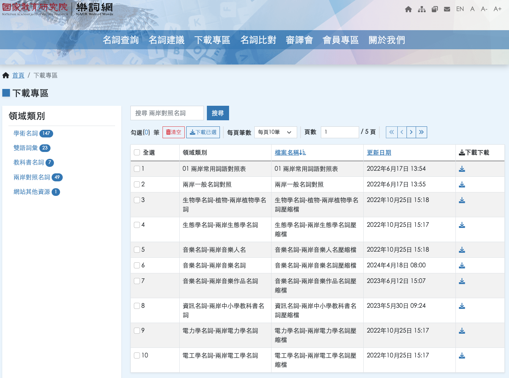

# S2T_Transformation (PO 檔案翻譯工具)

已知 bug

- [ ] 無法手動，目前會全自動檢查 QAQ。
- [ ] 樂詞網有些奇怪詞彙 例如『拉』跟『圖』，每次自動運行完進行修改 ods 詞彙文件後再次運行。

- 詞網加油好嗎？


## 功能描述

這個工具用於將 `.po` 檔案中的簡體中文文本翻譯成繁體中文。它讀取指定的輸入 `.po` 檔案，執行翻譯，並將結果輸出到新的檔案中。


1. 採用樂詞網的 ods 文件進行簡詞翻譯
2. 會針對 msgid 與 msgstr 進行翻譯
3. 翻譯結果可以由 log 進行查詢
4. 針對 taotixxxx 所使用的簡詞繁體字型詞彙進行處理(如果全部都是簡體字到沒問題)
   

- 本專案需要將樂詞網下載 ods 放置於 dataset 中，請於下面連結進行下載。

  https://terms.naer.edu.tw/download/10/

  

## 使用方法

### 建置使用環境(conda)

1. 安裝 Conda：
   如果你尚未安裝 Conda，請先下載並安裝 Miniconda 或 Anaconda。根據你的作業系統下載適用於 Python 3.8 的版本。
2. 開啟終端或命令提示字元：
   安裝完 Conda 後，打開終端（在 Windows 上是命令提示字元）。
3. 建立新環境：
   在終端中運行以下命令以建立新的 Python 3.8.19 環境：
   ```
    conda create --name chinese_corrector python=3.8.19
   ```
4. 啟動環境：
   完成後，你可以啟動新建立的環境。在終端中運行以下命令：
   ```
    conda activate chinese_corrector
   ```
5. 安裝 python 相依：
   ```
    pip install -r requirements.txt
   ```

## 在 Jupyter Notebook 中運行以下代碼塊來使用此工具

需要修改的內容如下(本項目可以直接運行)，有需求在進行修改：

```
input_document = "KiCad Taipei source zh Hant.po"
output_document = "KiCad_dev_testdata_translated.po"
auto_mode = True  # 手動模式 有bug還沒修好= =
debug_mode = False  # 開啟會打印更多資訊
logging_mode = True #如果開啟 會將有翻譯的行數與翻譯前後結果記錄於另外檔案
```

## 執行翻譯函數

```
process_po_file(input_document, output_document, translation_dict, auto_mode=False, debug_mode=True, logging_mode=True)
```


## 查看翻譯記錄

會於 log 底下產出文字檔，並且可以查看翻譯作為翻譯品質，並進行 ods 的數據修改後再次運行。

