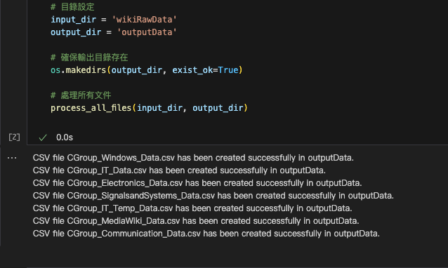
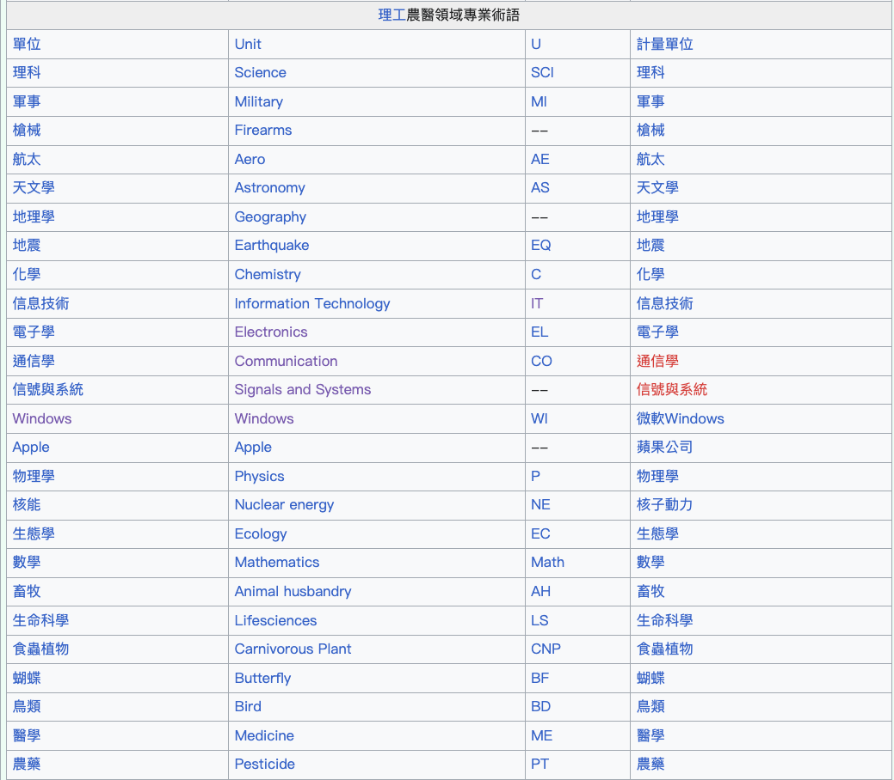

## 從 Wiki CGroup 獲取對應數據進行轉換

https://zh.wikipedia.org/wiki/Module:CGroup

- 將要轉換的文本放置於 wikiRawData 資料中，於 jupyer 運行代碼即可，資料皆放於 outputData。
- wikiRawData 採用倒序加載，可以想像，越慢加載的權限越高，0_Kicad_PoMingLee 因為檔名最前面的 0 會讓它牌到最後。
  0_Kicad_PoMingLee 有提到渲染與其他文件彩現衝突，但會以 0_Kicad_PoMingLee 文件為最新。
  
